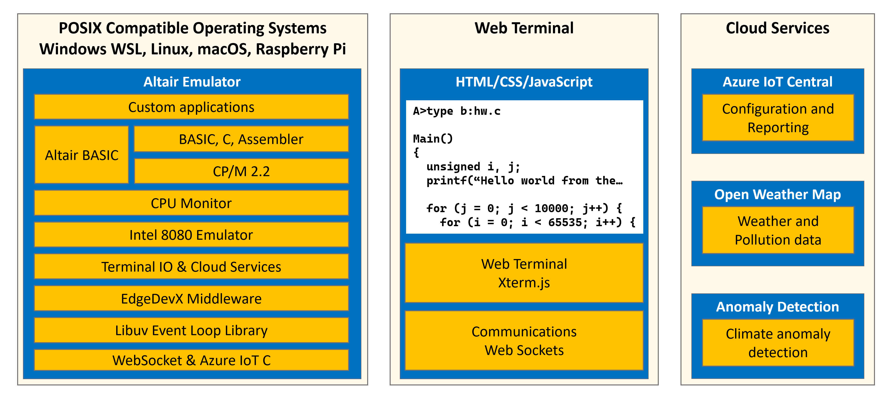
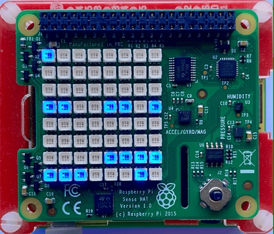

The Altair 8800 emulator is a software program that emulates the Altair 8800 computer. The Altair emulator is written in C and runs on most desktop operating systems as well as devices like the Raspberry Pi, Beaglebone, and Azure Sphere.

This is version 5 of the Altair 8800 emulator project and it shares a similar code base as the [Azure Sphere Cloud-Enabled Altair 8800](https://github.com/AzureSphereCloudEnabledAltair8800/AltairOnAzureSphere){:target=_blank} as featured on the Register "[Microsoft adds cloud enablement to 1970s Altair 8800 tech](https://www.theregister.com/2021/07/16/altair_redux/){:target=_blank}".

## Source code

- The Altair emulator source code is maintained in the [Altair 8800 Emulator](https://github.com/gloveboxes/Altair-8800-Emulator){:target=_blank} GitHub repo.
- The soltion is Open Source and is provided under an MIT License, and contributions are very welcome.

## Architecture

The Altair emulator runs on [POSIX](https://en.wikipedia.org/wiki/POSIX){:target=_blank} compatible operating systems including, Linux, Windows with [WSL 2](https://docs.microsoft.com/en-us/windows/wsl/install){:target=_blank}, macOS on Apple Silicon and Intel, as well as devices like Raspberry Pi, Beaglebone, and Azure Sphere.

Starting from the bottom left and moving up and then to the right.

- **POSIX Compatible OS:**. The Altair 8800 emulator runs on [POSIX](https://en.wikipedia.org/wiki/POSIX){:target=_blank} compatible operating systems, including Linux, macOS, [Windows WSL 2](https://docs.microsoft.com/windows/wsl){:target=_blank}, and Raspberry Pi OS.
- **WebSocket & Azure IoT C:** These communication libraries connect the Altair emulator to the web terminal and cloud services. The Altair terminal IO messages are routed over [WebSockets](https://en.wikipedia.org/wiki/WebSocket){:target=_blank}, and the IoT data over MQTT.
- **Event library:** The Altair coordinates activities on the main thread using the [event](https://libevent.org/){:target=_blank} event loop library.
- **EdgeDevX:** This library simplifies access to Azure IoT services, provides event-timer services, along with several useful utilities.
- **Terminal IO & Cloud Services:** The Intel 8080 CPU provides 256 input ports and 256 output ports. The Intel 8080 ports were used to integrate peripherals such as disk drives, printers, and modems. However, for the Altair emulator, these ports are used to integrate communications and cloud services. Terminal input and output ports are routed over WebSockets, other ports are used for timing services, access to weather and pollution data, plus Azure IoT services.
- **Intel 8080 emulator:** This is an open-source software implementation of the Intel 8080 CPU. The Intel 8080 emulator executes Intel 8080 applications including the CP/M operating system, compilers, apps, and games.
- **CPU Monitor:** The CPU monitor implements the virtual Altair front panel, along with memory disassembler, tracer, and Altair emulator reset.
- **CP/M:** CP/M originally stood for Control Program/Monitor. Later, CP/M became known as Control Program for Microcomputers. It was a mass-market operating system created in 1974 for Intel 8080/85-based microcomputers by Gary Kildall of Digital Research, Inc.
- **Programming languages:** Included on the main disk image are the Microsoft BASIC interpreter, the BDS C compiler, and the Intel and Microsoft assemblers and linkers.
- **Altair BASIC:** By default the Altair emulator boots CP/M, but it is easy to boot the original Altair BASIC program.
- **Altair Web Terminal:** Provides a web-browser hosted Altair terminal. The web terminal is built using the Xterm library. Xterm.js provides a web browser-hosted terminal, a WebSocket integrates Xterm with the Altair emulator.
- **Open Weather Map**: Open Weather Map provides planet-scale weather and pollution data services. Open Weather Map provides free access to weather and pollution data by geographic location.
- **ThingsBoard:** ThingsBoard is an open-source IoT platform for data collection, processing, visualization, and device management. ThingsBoard supports industry-standard IoT protocols: MQTT, CoAP, and HTTP. The Altair emulator uses the MQTT protocol to connect to ThingsBoard.

## Raspberry Pi with a Pi Sense HAT

There is specific support for the Altair emulator running on a Raspberry Pi with a Pi Sense HAT. The Altair emulator has been tested on the following [Raspberry Pi](https://www.raspberrypi.org/){:target=_blank} models: Zero 2W, 2B, 3A, 3B, 4B, 5B running Raspberry Pi OS 64-bit.

The Raspberry Pi paired with a [Pi Sense HAT](https://www.raspberrypi.com/products/sense-hat/){:target=_blank} displays the Altair address and data bus activity on the 8x8 LED panel.

| Raspberry Pi with Pi Sense HAT  | Raspberry Pi Sense HAT |
|--|--|
|  |  |
