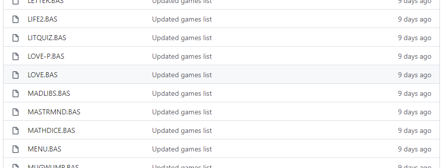

CP/M originally stood for Control Program/Monitor. Later, CP/M became known as Control Program for Microcomputers. It was a mass-market operating system created in 1974 for Intel 8080/85-based microcomputers by Gary Kildall of Digital Research, Inc.

The first version was single-tasking on 8-bit processors with support for up to 64 kilobytes of memory. Later versions of CP/M added multiple-user variations and were migrated to 16-bit processors.

For more information about CP/M, see the [CP/M Wikipedia article](https://en.wikipedia.org/wiki/CP/M?azure-portal=true) and [CP/M Frequently Asked Questions](http://www.gaby.de/faq.htm).

## Digital Research CP/M Operating System Manual

You will find a wealth of information about CP/M, including compilers, assemblers, debuggers, and more in the [Digital Research CP/M Operating System Manual](http://www.gaby.de/cpm/manuals/archive/cpm22htm/)

## Programming the Altair emulator

From CP/M, you can program the Altair emulator using Microsoft BASIC, BD Software C, the Intel Assembler and Linker, and the Microsoft MACRO-80 Assembler.

## Get started with CP/M

Here are some CP/M commands to get you started:

- Changing drives. The Altair emulator mounts two drives, drive A and drive B. To change drives, from the Altair CP/M command prompt in the Web Terminal, type the drive name, then press the Enter key.

    ```cpm
    a:

    b:
    ```

- Display a directory listing.

    ```cpm
    dir

    dir *.BAS

    ls
    ```

- Erase a file.

    ```cpm
    era *.txt
    ```

- Copy Microsoft BASIC `mbasic.com` from drive A to drive B.

    ```cpm
    a:pip b:mbasic.com.com=a:mbasic.com
    ```

- List the contents of a file.

    ```cpm
    type hw.c
    ```

- Rename a file.

    ```cpm
    ren hello.c=hw.c
    ```

## Get started with retro gaming

## Download a retro game

The following is an example of copying the `love.bas` game to the CP/M filesystem using the CP/M `gf` command.



1. Review the [Retro Games](https://github.com/AzureSphereCloudEnabledAltair8800/RetroGames) repo.
1. From the Altair web terminal CP/M command prompt, run the **Get File** command:

    ```cpm
    gf
    ```

1. Select endpoint 1 (GitHub)
1. Type the name of the file to be transferred. For example **LOVE.BAS**. Note, that the filenames are case sensitive.
1. Press <kbd>Enter</kbd> to start the transfer.
1. From the CP/M command line, start the game. For example

    ```cpm
    mbasic love
    ```

Note, a lot of the retro games in the repo expect to find **MENU.BAS** in the CP/M filesystem. So be sure to transfer MENU.BAS as well.

## Retro game acknowledgments

This list of games was made possible by the dedicated work of [CP/M Games](http://www.retroarchive.org/cpm/games/games.htm) and [Vintage BASIC](http://www.vintage-basic.net/games.html).
