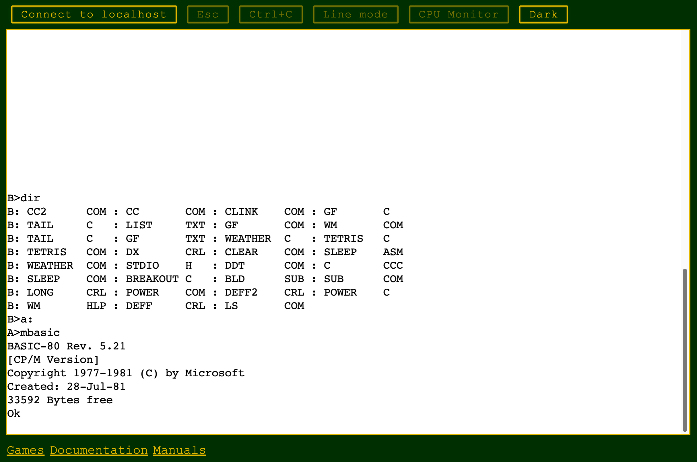

You can start the Altair 8800 emulator Docker container with the `docker run` command. There are several options you can use to configure the Altair emulator.

## Altair 8800 Standard Mode

1. This option is recommended for most users and works on 64-bit versions of [Linux, macOS, Windows, and Raspberry Pi](#general-linux-macos-windows-and-raspberry-pi-users).

    ```shell
    docker run --user root -p 8082:8082 -p 80:80 --name altair8800 --rm glovebox/altair8800:latest
    ```

## Altair 8800 Advanced Modes

The Altair 8800 emulator also has several advanced modes that you can enable to customize the Altair emulator. These include:

1. Set the time zone.
1. Connect to an MQTT broker to publish the Altair address and data bus information.
1. Connect to the Open Weather Map service to get the current weather information for your location.
1. Run on a Raspberry Pi with a Pi Sense HAT to display the address and data bus information on the Pi Sense HAT 8x8 LED panel.

### Docker environment variables

The Altair emulator supports several Docker environment variables to configure its behavior and the easiest way to set these is with the env file `--env-file` option.

Open the `altair.env` file in a text editor and set the environment variables you want to use. Then, start the Altair emulator Docker container with the `--env-file` option.

```shell
docker run --env-file altair.env --user root -p 8082:8082 -p 80:80 --name altair8800 --rm glovebox/altair8800:latest
```

### Time Zone

You can set the time zone with the `TZ=YOUR_TIME_ZONE` environment variable. For example, to set the time zone to Sydney, Australia, use `TZ=Australia/Sydney`. See the [list of time zones](https://en.wikipedia.org/wiki/List_of_tz_database_time_zones) for your location.

### MQTT Broker

You can connect to an MQTT broker to publish the Altair address and data bus information. You need to set the following environment variables.

* MQTT_HOST=`YOUR_MQTT_HOST`
* MQTT_PORT=`YOUR_MQTT_PORT` (default is 1883)
* MQTT_CLIENT_ID=`YOUR_MQTT_CLIENT_ID` (must be unique for each client connected to the MQTT broker)

#### ThingsBoard

The Altair emulator publishes telemetry data in the `ThingsBoard` format.

1. Telemetry data is sent to the MQTT topic `v1/devices/me/telemetry`.
2. You can install the free ThingsBoard Community Edition locally, including on devices like a Raspberry Pi. See the [ThingsBoard installation guide](https://thingsboard.io/docs/user-guide/install/installation-options/){:target="_blank"}.
3. In ThingsBoard, create an MQTT device to represent your Altair emulator. Make sure to use the same `MQTT_CLIENT_ID` when connecting from the Altair emulator.

### Open Weather Map

You can connect to the Open Weather Map service to get the current weather information for your location. You need to set the following environment variable.

* OPEN_WEATHER_MAP_API_KEY=`YOUR_OPEN_WEATHER_MAP_API_KEY` (you can get a free API key by signing up at [Open Weather Map](https://openweathermap.org/api){:target="_blank"})

### Raspberry Pi with Pi Sense HAT

You can run the Altair emulator on a Raspberry Pi with a Pi Sense HAT Attached. The Pi Sense HAT 8x8 LED panel can display the Altair address and data bus information can also be switched between *Font* and *bitmap* modes for games.

| Raspberry Pi with Pi Sense HAT  | Raspberry Pi Sense HAT |
|--|--|
|  |  |

#### Enable the Pi Sense HAT

You must set the front panel environment variable.

* FRONT_PANEL=`sensehat` (Options include sensehat, kit, none, the default is `none`)

#### Enable I2C hardware access

You must enable I2C hardware access and pass the `--device` option to the `docker run` command.

1. Enable I2C hardware access on the Raspberry Pi. You can do this with the `raspi-config` tool.

    ```bash
    sudo raspi-config nonint do_i2c 0
    ```

2. Pass the `--device` option to the `docker run` command.

   * `--device=/dev/i2c-1` (this enables I2C hardware access to the Pi Sense HAT)

   ```shell
   docker run --device=/dev/i2c-1 --env-file altair.env --user root -p 8082:8082 -p 80:80 --name altair8800 --rm glovebox/altair8800-pisense:latest
   ```

## Altair disk storage

The Altair emulator disks can be stored in a Docker persistent storage volume. This ensures any changes made to the contents of the Altair disks are saved if the Docker container is stopped or deleted.

```shell
docker run -v altair-disks:/app/Disks --user root -p 8082:8082 -p 80:80 --name altair8800 --rm glovebox/altair8800:latest
```

or passing environment variables using the environment file

```shell
docker run -v altair-disks:/app/Disks --env-file altair.env --user root -p 8082:8082 -p 80:80 --name altair8800 --rm glovebox/altair8800:latest
```

## Open the Web Terminal

Open the Web Terminal to access the Altair emulator. Follow these steps.

1. Familiarize yourself with the [Web Terminal](../20-fundamentals/25-Web-Terminal.md) and the CP/M operating system.
2. Open your web browser:
    * Navigate to `http://localhost` if you deployed the Altair emulator on your local computer.
    * Navigate to `http://hostname_or_ip_address` if you deployed the Altair emulator on a remote computer.

    

### Connecting a remote Altair emulator

You can pass an optional `altair` query parameter to the URL to connect to a remote Altair emulator. For example, if the Altair emulator is running on a computer with the IP address `192.168.1.100`, you can connect to it by navigating to `http://localhost?altair=192.168.1.100`.

## Docker tips and tricks

### Stop the Altair emulator Docker container

Use the following command to stop the Altair emulator Docker container.

```bash
docker stop altair8800
```

### Restart the Altair emulator Docker container

Use the following command to start the Altair emulator Docker container that you previously stopped.

```bash
docker start altair8800
```

### Delete the Altair emulator Docker container

First, stop the Altair emulator Docker container, then delete the Altair emulator container.

Use the following command to delete the Altair Docker container.

```bash
docker container rm altair8800
```

### Inspect the persistent storage volume

```bash
docker volume inspect altair-disks
```

### Check the data in the persistent storage volume

```bash
sudo ls /var/lib/docker/volumes/altair-disks/_data -all
```

### To remove the persistent storage volume

```bash
docker volume rm altair-disks
```
