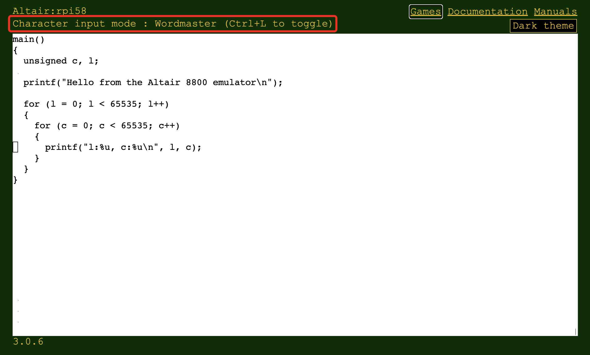

# Editing Files: Developer Workflow

You can work with files for the Altair CP/M system in two primary ways:

1. **External editor on your host (Recommended)** – Edit locally with a modern editor such as Visual Studio Code. This gives you syntax highlighting, search, Copilot / LLM assistance, version control, etc.
2. **On‑emulator editing (Word-Master)** – Edit inside the emulated CP/M environment using the bundled Word-Master editor. Authentic, but slower and less ergonomic for substantial changes.

## Editing Files with External Tools (Recommended)

Follow this fast loop for most development:

1. **Pick an editor** – Example: [Visual Studio Code](https://code.visualstudio.com/){:target=_blank} (with optional Copilot / LLM assistance).
2. Create a folder on your host computer to hold your source files.
3. **Create or modify your source** – Edit as normal on your host (BASIC, C, ASM, etc.).
4. **Expose the directory over HTTP** – Either:
    * Use the VS Code Use the [Visual Code Live Server (Five Server) extension](https://marketplace.visualstudio.com/items?itemName=ritwickdey.LiveServer){:target=_blank} extension, or
    * Use a simple built‑in Python server:

      ```bash
      python -m http.server 5500
      ```

5. **Tell the Altair side where to fetch files** – In the Altair web terminal, set the HTTP endpoint (only needed once per session):

    Change to the `B:` drive first if not already there.

    ```cpm
    gf -e <your_ip_address>:5500
    ```

    This corresponds to `http://<your_ip_address>:5500`.

    Note, the endpoint is stored in a file on the emulated disk called `gf.txt` so it persists across emulator restarts.

6. **Transfer a file into CP/M** – From the CP/M prompt:

    ```cpm
    gf -f hello.bas
    ```

    (File names are case‑insensitive; CP/M convention is uppercase.)

7. **Run or build** – Examples:
    * BASIC: `mbasic hello`

Repeat steps 2, 5, and 6 as you refine your program.

### Automating Transfers & Builds with CP/M SUBMIT

The Submit command automates file transfer and build steps and is a a time-saver.

Prerequisite: Ensure the endpoint is already set (`gf -e <your_ip_address>:5500`).

On the `B:` drive there are two helper submit files: `C.SUB` and `ASM.SUB`.

They perform (a) fetch via `gf -f`, then (b) compile / assemble, then (c) link.

Examples:

#### Transfer, compile, and link a C source file

```cpm
submit c hello
```

!!! info

    The `c.sub` file fetches the source file, compiles it with BDS C, then links it to create `hello.com`.

    ```plaintext
    gf -f $1.c
    cc $1   
    clink $1 dxweb dxtimer
    ```

Now you can run the program:

```cpm
hello
```

#### Transfer, assemble, and link an assembly source file

Change to the `B:` drive first if not already there.

```cpm
submit asm vibe
```

!!! info

    The `asm.sub` file fetches the source file, assembles it with ASM80, then links it to create `demo.com`.

    ```plaintext
    gf -f $1.asm
    d:asm $1
    d:load $1
    era $1.prn
    era $1.hex
    ```

Now you can run the program:

```cpm
vibe
```

## Editing Files with the Word-Master Text Editor

The emulator bundles [MicroPro Word-Master](https://github.com/AzureSphereCloudEnabledAltair8800/Altair8800.manuals/blob/master/Word-Master_Manual.pdf){:target=_blank}. Historically powerful, but spartan compared with modern editors.

### Ten‑minute video introduction

Fastest workflow: edit with Visual Studio Code, then copy using `gf`. Watch the video for an overview:

[▶ Video: Editing Files Workflow (YouTube)](https://www.youtube.com/watch?v=3C_5WcSWqro){:target=_blank}

If embedding is required later, update the markdown linter configuration to allow `iframe` (rule MD033) and restore the embed.

### Editing inside Word-Master

Preferred path remains: local edit + `gf` transfer. But if you want the authentic experience:

1. Toggle the web terminal to character mode (`Ctrl+L`).
2. Launch Word-Master (e.g., `wm filename.asm`).
3. Use the control key commands below for navigation / editing.
4. When finished, exit Word-Master, then toggle back to line mode (`Ctrl+L`) for faster terminal interaction.



For full details see the [Word-Master user guide](https://github.com/AzureSphereCloudEnabledAltair8800/Altair8800.manuals/blob/master/Word-Master_Manual.pdf?azure-portal=true){:target=_blank}.

The following table lists the Ctrl characters that Word-Master uses. This list is sourced from the [Experiencing the Altair 8800](https://glasstty.com/?p=1235){:target=_blank} blog.

```text
VIDEO MODE SUMMARY

^O   INSERTION ON/OFF           RUB  DELETE CHR LEFT
^S   CURSOR LEFT CHAR           ^G   DELETE CHR RIGHT
^D   CURSOR RIGHT CHAR          ^\   DELETE WORD LEFT
^A   CURSOR LEFT WORD           ^T   DELETE WORD RIGHT
^F   CURSOR RIGHT WORD          ^U   DELETE LINE LEFT
^Q   CURSOR RIGHT TAB           ^K   DELETE LINE RIGHT
^E   CURSOR UP LINE             ^Y   DELETE WHOLE LINE
^X   CURSOR DOWN LINE           ^I   PUT TAB IN FILE
^^   CURSOR TOP/BOT SCREEN      ^N   PUT CRLF IN FILE
^B   CURSOR RIGHT/LEFT LINE     ^@   DO NEXT CHR 4X
^W   FILE DOWN 1 LINE           ^P   NEXT CHR IN FILE
^Z   FILE UP 1 LINE             ^V   NEXT CHR(S) TO VIDEO
^R   FILE DOWN SCREEN           ESC  EXIT VIDEO MODE
^C   FILE UP SCREEN             ^J   DISPLAY THIS

```

In character input mode, these host key mappings help mirror Word-Master's control sequences:

```text
Keyboard key            Word-Master Ctrl Sequence
----------------------------------------------
Insert                  ^O   INSERTION ON/OFF
Delete                  ^G   DELETE CHR RIGHT
Cursor Left             ^S   CURSOR LEFT CHAR
Cursor Right            ^D   CURSOR RIGHT CHAR
Cursor Up               ^E   CURSOR UP LINE
Cursor Down             ^X   CURSOR DOWN LINE
```
