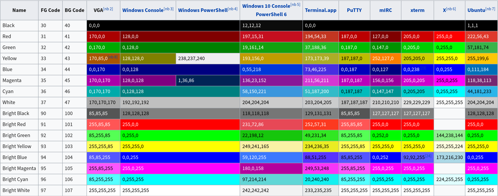
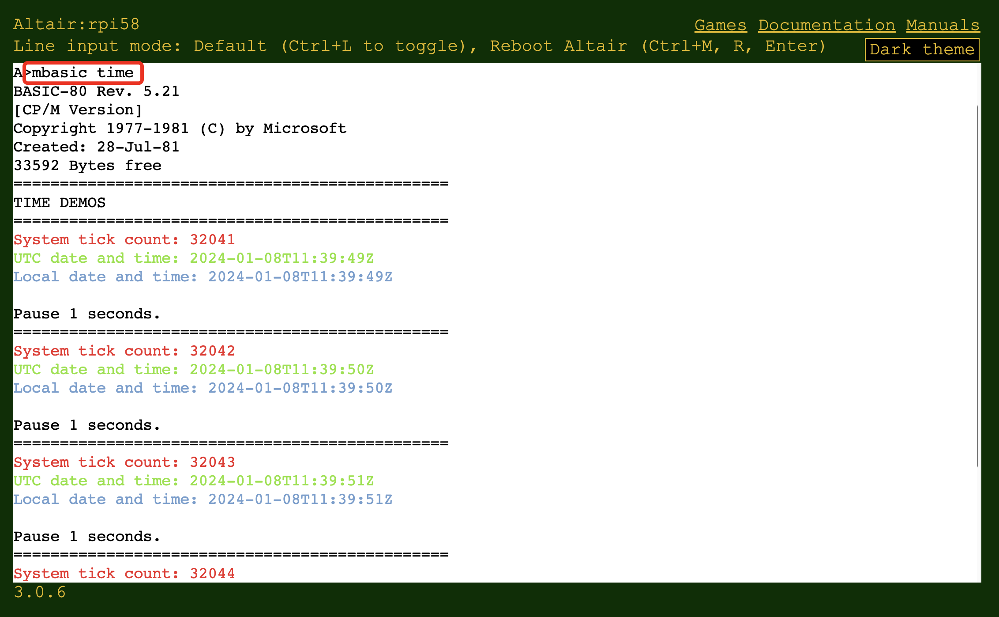
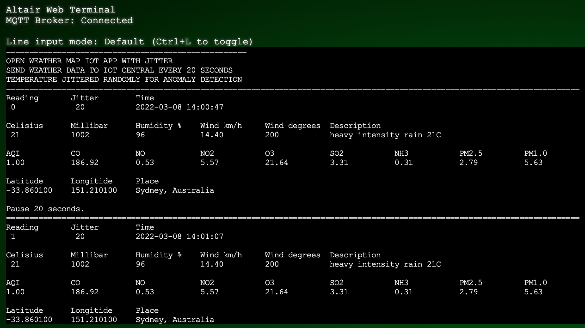

Bill Gates and Paul Allen wrote [Altair BASIC](https://en.wikipedia.org/wiki/Altair_BASIC?azure-portal=true). It was Microsoft's first product. Later, Microsoft released Microsoft BASIC for CP/M, see the [Microsoft BASIC-80 reference manual](https://github.com/AzureSphereCloudEnabledAltair8800/Altair8800.manuals/blob/master/AA-P226A-TV_BASIC-80_Reference_Manual_VT180_V5.21_1981.pdf?azure-portal=true).

In the following exercise, you'll learn how to write your first Microsoft BASIC application.

## Get started with Microsoft BASIC-80

Microsoft BASIC-80 is included on drive A.

1. Switch back to the web terminal in your web browser.

1. From the CP/M command prompt, run the following command to start Microsoft BASIC.

    ```bash
    mbasic
    ```

1. Run an interactive command

    ```basic
    print "Hello, world!"
    ```

    The BASIC interpreter with execute the command immediately and display **Hello, World!**.

1. Enter your first program:

    ```basic
    10 for i = 1 to 1000000
    20 print i
    30 next i
    ```

1. Run your program

    ```basic
    run
    ```

1. Stop the program by selecting **Ctrl+C**.

1. Save your program to disk:

    ```basic
    save "TEST.BAS"
    ```

    > Name all files using **CAPITAL LETTERS**.

1. Load your program from disk:

    ```basic
    load "TEST.BAS"
    ```

1. Quit BASIC:

    ```basic
    system
    ```

1. Run the following command to start your BASIC application from the CP/M command prompt.

    ```cpm
    mbasic test
    ```

You can learn more about BASIC from the following BASIC applications included with the Altair emulator:


- **COUNT.BAS** demonstrates how to use the Intel 8080 IO Port 30 to sleep or delay an application for a specific period.
- **DISKRW.BAS** is a test application that opens and repeatedly reads and writes a text file.
- **FONT.BAS** shows how to write ASCII characters to the 8x8 LED panels on the Pi Sense HAT or Retro Click.
- **JSON.BAS** reads weather and pollution data and then publishes JSON data to Azure IoT Central.
- **LOOPY.BAS** is a test application that generates a lot of messages.
- **STARTREK.BAS** is a game.
- **TICTAK.BAS:** A simple game of naughts and crosses.
- **TIME.BAS** demonstrates how to use the time Intel 8080 IO ports including setting a sleep timer, access to the system tick counter, and local and UTC date and times.
- **WEATHER.BAS** reads weather and pollution data from Open Weather Map and adds random [jitter](https://en.wikipedia.org/wiki/Jitter) to the temperature data at random intervals. The jittered temperature is used for anomaly detection. The weather and pollution data is then streamed to Azure IoT Central at regular intervals.

## Setting text colors

Text color can be controlled using 4-bit VT220 control characters. For more information, refer to [List of ANSI color escape sequences](https://stackoverflow.com/questions/4842424/list-of-ansi-color-escape-sequences).

The standards implementing terminal colors began with limited (4-bit) options. The table below lists the RGB values of the background and foreground colors used for these by a variety of terminal emulators:



## Use Intel 8080 input and output ports

The BASIC language has support for Intel 8080 CPU input and output port instructions. The TIME.BAS application:

- gets the system tick count from port 41
- gets the UTC date and time from port 42
- gets the local date and time from port 43
- and sets a sleep period using output port 30, and then waits on input port 30 for the delay period to expire.

For more information about Intel 8080 IO port mappings, refer to [Intel 8080 input and output ports](https://github.com/gloveboxes/Altair8800.Emulator.UN-X/wiki#intel-8080-input-and-output-ports).



The following BASIC program is the listing of *TIME.BAS*. The Time app uses color escape codes to control text colors.

```basic
10 WIDTH 100
20 PRINT "===================================================="
30 PRINT "TIME DEMOS"
40 SECONDS% = 1

50 WHILE 1
60 PRINT "==============================================="

70 PORT = 41 : GOSUB 160 : PRINT chr$(27) + "[91;22;24m" + "System tick count: ";RSTRING$;chr$(27) + "[0m"
80 PORT = 42 : GOSUB 160 : PRINT chr$(27) + "[92;22;24m" + "UTC date and time: ";RSTRING;chr$(27) + "[0m"
90 PORT = 43 : GOSUB 160 : PRINT chr$(27) + "[94;22;24m" + "Local date and time: ";RSTRING$; chr$(27) + "[0m"

130 GOSUB 230

140 WEND
150 END

160 REM SUBROUTINE READS STRING DATA FROM PORT UNTIL NULL CHARACTER
170 RSTRING$ = ""
175 OUT PORT, 0
180 C=INP(200)
190 IF C = 0 THEN RETURN
200 RSTRING$ = RSTRING$ + CHR$(C)
210 GOTO 180

220 REM PAUSE FOR N NUMBER OF SECONDS
230 PRINT "" : PRINT "Pause";SECONDS%;"seconds."
240 OUT 30, SECONDS%
250 WAIT 30, 1, 1
260 RETURN
```

### Run the TIME.BAS application

1. To start Microsoft BASIC, from the CP/M command prompt, enter:

    ```cpm
    mbasic time
    ```

    Microsoft BASIC starts and runs the *TIME.BAS* application. The *TIME.BAS* application displays the system tick count, along with the local and UTC date and time.

1. Stop the program by selecting **Ctrl+C**.

### Run the WEATHER.BAS application

The WEATHER.BAS application reads weather and pollution data provided by Open Weather Map. Like the COUNT.BAS application, WEATHER.BAS uses Intel 8080 IO Ports to access the data.



The following BASIC program is the listing of *WEATHER.BAS*:

```basic
100 WIDTH 150
200 PRINT "===================================================="
300 PRINT "OPEN WEATHER MAP IOT APP"
400 SECONDS% = 10
500 WEATHERKEY = 34
600 WEATHERVALUE = 35
700 WEATHERITEMS = 6
800 LOCATIONKEY = 36
900 LOCATIONVALUE = 37
1000 LOCATIONITEMS = 4
1100 POLLUTIONKEY = 38
1200 POLLUTIONVALUE = 39
1300 POLLUTIONITEMS = 9
1400 PRINT "PUBLISH WEATHER DATA TO IOT CENTRAL EVERY";SECONDS%;"SECONDS"
1500 RCOUNT% = 0
1600 READING# = 0
1700 WHILE 1
1800 READING# = READING# + 1
1900 PRINT "============================================================================================================================"
2000 PORT = 43 : GOSUB 4300 : TIME$ = RSTRING$
2100 PRINT "Reading", "Time"
2200 PRINT READING#,  TIME$
2300 ITEMKEY = WEATHERKEY : ITEMVALUE = WEATHERVALUE : ITEMS = WEATHERITEMS : GOSUB 3300
2400 PRINT
2500 ITEMKEY = POLLUTIONKEY : ITEMVALUE = POLLUTIONVALUE : ITEMS = POLLUTIONITEMS : GOSUB 3300
2600 PRINT
2700 ITEMKEY = LOCATIONKEY : ITEMVALUE = LOCATIONVALUE : ITEMS = LOCATIONITEMS : GOSUB 3300
2800 PRINT
2900 GOSUB 5400 : REM PUBLISH WEATHER DATA
3000 GOSUB 5000 : REM SLEEP
3100 WEND
3200 END
3300 REM PRINT ITEM KEY VALUE PAIRS
3400 PRINT
3500 FOR I = 1 TO ITEMS
3600 PORT = ITEMKEY : PDATA = I - 1 : GOSUB 4300 : PRINT RSTRING$, 
3700 NEXT I
3800 PRINT
3900 FOR I = 1 TO ITEMS
4000 PORT = ITEMVALUE : PDATA = I - 1 : GOSUB 4300 : PRINT RSTRING$, 
4100 NEXT I
4200 RETURN
4300 REM SUBROUTINE READS STRING DATA FROM PORT UNTIL NULL CHARACTER
4400 OUT PORT, PDATA
4500 RSTRING$ = ""
4600 C=INP(200)
4700 IF C = 0 THEN RETURN
4800 RSTRING$ = RSTRING$ + CHR$(C)
4900 GOTO 4600
5000 PRINT "" : PRINT CHR$(27) + "[31;22;24m" + "Sleep for"; SECONDS% ; "seconds." + CHR$(27) + "[0m"
5100 OUT 30, SECONDS%
5200 IF INP(30) = 1 THEN GOTO 5200
5300 RETURN
5400 REM PUBLISH WEATHER DATA
5500 REM WAIT FOR PUBLISH WEATHER PENDING TO GO FALSE
5600 WAIT 32, 1, 1
5700 REM PUBLISH TO IOT CENTRAL WITH JITTER
5800 OUT 32, 0
5900 RETURN
```

When you run this application, weather and pollution data are published to Azure IoT Central. You can view the data in the Azure IoT Central web portal, from the **Pollution** and **Weather** tabs for your device.


## Generating anomaly weather data

The anomaly app publishes weather data sourced from Open Weather Map to Azure IoT Central. The anomaly app adds random jitter values to the temperature. The jitter values are added to the temperature so you can see the effect of anomalies when using the [Azure Anomaly Detection Cognitive Service](https://azure.microsoft.com/services/cognitive-services/anomaly-detector/).


```basic
100 WIDTH 150
200 PRINT "===================================================="
300 PRINT "OPEN WEATHER MAP IOT APP"
400 DELAY% = 10
500 WEATHERPORT = 35
600 LOCATIONPORT = 37
700 POLLUTIONPORT = 39
800 DEF FNNEXTJITTER(ROW#, DELAY%) = ROW# + 1 + (INT(RND * 60) * 180 / DELAY% )
900 DEF FNJITTERTEMPERATURE(TEMPERATURE$) = VAL(TEMPERATURE$) + 30 - INT(RND * 20) : REM Return temperature plus random value
1000 REM GET RANDOM NUMBER SEED FROM PLATFORM
1100 PORT = 44 : GOSUB 4700 : RANDOMIZE VAL(RSTRING$)
1200 PRINT "SEND WEATHER DATA TO IOT CENTRAL EVERY";DELAY%;"SECONDS"
1300 RCOUNT# = 0
1400 NEXTJITTER# = FNNEXTJITTER(RCOUNT#, DELAY%)
1500 WHILE 1
1600 RCOUNT# = RCOUNT# + 1
1700 PRINT "===================================================="
1800 PRINT CHR$(27) + "[33;22;24m" + "Reading:"; RCOUNT#; "| Next jitter:";NEXTJITTER#; "| BASIC free memory:"; FRE(0); CHR$(27) + "[0m"
1900 REM GET TIME AS STRING
2000 PORT = 43 : GOSUB 4700 : PRINT "Time (local): ";RSTRING$
2100 PORT = WEATHERPORT : PDATA = 0 : GOSUB 4700 : TEMPERATURE$ = RSTRING$
2200 PORT = WEATHERPORT : PDATA = 1 : GOSUB 4700 : PRESSURE$ = RSTRING$
2300 PORT = WEATHERPORT : PDATA = 2 : GOSUB 4700 : HUMIDITY$ = RSTRING$
2400 PORT = POLLUTIONPORT : PDATA = 0 : GOSUB 4700 : AIRQUALITYINDEX$ = RSTRING$
2500 PORT = LOCATIONPORT : PDATA = 0 : GOSUB 4700 : LATITUDE$ = RSTRING$
2600 PORT = LOCATIONPORT : PDATA = 1 : GOSUB 4700 : LONGITUDE$ = RSTRING$
2700 IF RCOUNT# = NEXTJITTER# THEN TEMPERATURE$ = STR$(FNJITTERTEMPERATURE(TEMPERATURE$)) : NEXTJITTER# = FNNEXTJITTER(RCOUNT#, DELAY%)
2800 PRINT : PRINT "Celsius", "Millibars", "Humidity %", "AQI (CAQI)", "Latitude", "Longitude"
2900 PRINT TEMPERATURE$, PRESSURE$, HUMIDITY$, AIRQUALITYINDEX$, LATITUDE$, LONGITUDE$
3000 PRINT
3100 GOSUB 3700 : REM Generate JSON
3200 GOSUB 5900 : REM Publish JSON
3300 PRINT: PRINT CHR$(27) + "[31;22;24m" + "Sleep for";DELAY%;"seconds." + CHR$(27) + "[0m"
3400 GOSUB 5400
3500 WEND
3600 END
3700 REM BUILD JSON STRING
3800 RJSON$ = "{"
3900 RJSON$ = RJSON$ + CHR$(34) + "temperature" + CHR$(34) + ":" + TEMPERATURE$ + ","
4000 RJSON$ = RJSON$ + CHR$(34) + "pressure" + CHR$(34) + ":" +  PRESSURE$ + ","
4100 RJSON$ = RJSON$ + CHR$(34) + "humidity" + CHR$(34) + ":" +  HUMIDITY$ + ","
4200 RJSON$ = RJSON$ + CHR$(34) + "latitude" + CHR$(34) + ":" +  LATITUDE$ + ","
4300 RJSON$ = RJSON$ + CHR$(34) + "longitude" + CHR$(34) + ":" +  LONGITUDE$ + ","
4400 RJSON$ = RJSON$ + CHR$(34) + "aqi" + CHR$(34) + ":" +  AIRQUALITYINDEX$
4500 RJSON$ = RJSON$ + "}"
4600 RETURN
4700 REM SUBROUTINE READS STRING DATA FROM PORT UNTIL NULL CHARACTER
4800 OUT PORT, PDATA
4900 RSTRING$ = ""
5000 C=INP(200)
5100 IF C = 0 THEN RETURN
5200 RSTRING$ = RSTRING$ + CHR$(C)
5300 GOTO 5000
5400 REM SUBROUTINE DELAYS PROGRAM EXECUTION BY DELAY% SECONDS
5500 OUT 30, DELAY%
5600 IF INP(30) = 1 THEN GOTO 5600
5700 WAIT 31, 1, 1 : REM WAIT FOR PUBLISH JSON PENDING TO GO FALSE
5800 RETURN
5900 REM SUBROUTINE PUBLISHES JSON TO AZURE IOT
6000 LENGTH% = LEN(RJSON$)
6100 IF LENGTH% = 0 THEN RETURN
6200 IF LENGTH% > 256 THEN RETURN
6300 PRINT CHR$(27) + "[94;22;24m" + "PUBLISHING JSON TO AZURE IOT" + CHR$(27) + "[0m"
6400 PRINT RJSON$
6500 FOR DATAINDEX% = 1 TO LENGTH%
6600 OUT 31, ASC(MID$(RJSON$, DATAINDEX%, 1))
6700 NEXT DATAINDEX%
6800 OUT 31, 0 : REM TERMINATING NULL CAUSE PUBLISH TO AZURE IOT
6900 RETURN
```

## Font support

The following example shows how to use the Intel 8080 IO ports to display characters on the Pi Sense HAT or Retro Click 8x8 LED panels. To understand IO ports, refer to the [io_ports.c](https://github.com/gloveboxes/Altair8800.Emulator.UN-X/blob/main/AltairHL_emulator/io_ports.c) source code.

```basic
100 REM 8x8 LED Panel Demo
200 OUT 80,1 : REM Flip the 8x8 LED panel to FONT mode
300 FOR J = 1 TO 10
400 FOR I = 33 TO 122
500 OUT 81, I MOD 3 : REM Cycle font color
600 OUT 85, I : REM Display character on the 8x8 LED panel
700 PRINT CHR$(I)
800 OUT 29, 250 : WAIT 29, 1, 1 : REM Pause for 250 milliseconds
900 NEXT I
1000 NEXT J
1100 OUT 80,0
```
