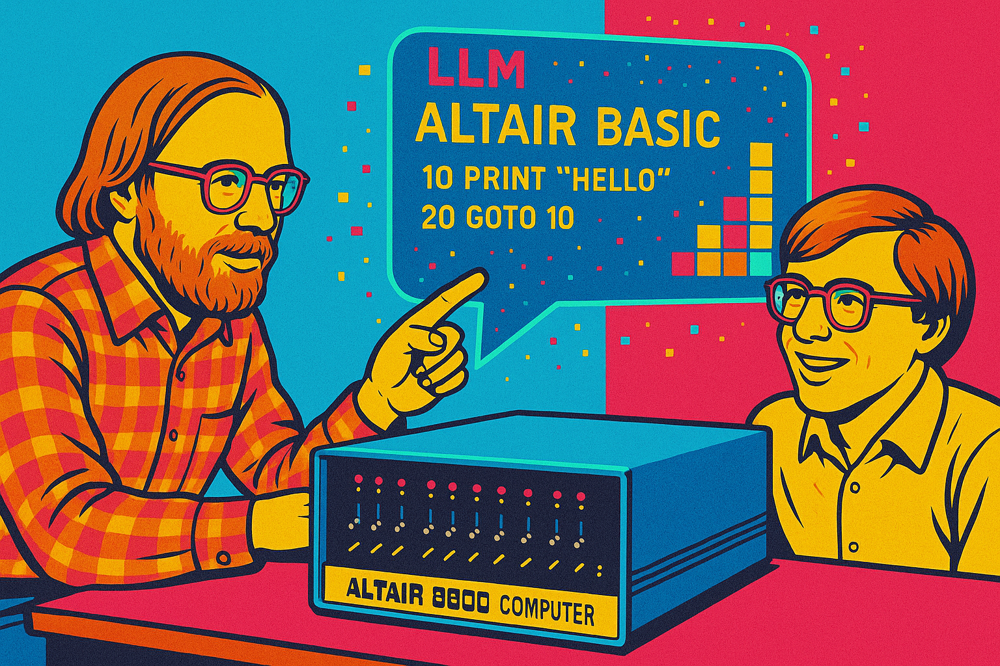

The goal of the cloud-connected Altair project is to provide a unique blend of [computing history](https://en.wikipedia.org/wiki/Retrocomputing){:target=_blank} with modern cloud computing. You'll learn about computing fundamentals, software development, and modern IoT, Data, and AI cloud services that address today's real-world IT challenges.

The [Altair 8800](https://en.wikipedia.org/wiki/Altair_8800?azure-portal=true){:target=_blank} kick-started the personal computer revolution. Microsoft's first product was [Altair BASIC](https://en.wikipedia.org/wiki/Altair_BASIC?azure-portal=true){:target=_blank} written for the Altair 8800 by Bill Gates and Paul Allen. At the time, Altair BASIC was a huge step forward as it allowed people to write programs using a high-level programming language.

<!-- ## Get started docs

Head to [Get started](/start/Deploy){:target=_blank} to learn how to deploy and run the Altair 8800 emulator. -->

The Altair project provides a fun way to learn:

1. [Vibe code](https://en.wikipedia.org/wiki/Vibe_coding){:target=_blank} Altair 8800 applications using Intel 8080 Assembly, BDS C, and Microsoft BASIC, with help from Large Language Models (LLMs) such as Claude Sonnet or OpenAI Codex, in VS Code with GitHub Copilot.
2. Learn to build multithreaded, event-driven IoT C applications that scale from [microcontrollers](https://en.wikipedia.org/wiki/Microcontroller){:target=_blank} and [Raspberry Pis](https://en.wikipedia.org/wiki/Raspberry_Pi){:target=_blank} to desktop-class computers.
3. Safely explore machine-level programming, including Intel 8080 Assembly, C, and BASIC development.
4. Enjoy retro gaming and play classic games from the past.
5. Optionally, integrate free weather and pollution cloud services from [Open Weather Map](http://openweathermap.org){:target=_blank} and [ThingsBoard](https://thingsboard.io/){:target=_blank} for telemetry and control.
6. Optionally, stream telemetry data to the `ThingsBoard` MQTT Broker or a standalone Mosquitto MQTT Broker.

## Retro computing with Dave Glover and the Altair 8800

<iframe width="100%" height="420" src="https://www.youtube.com/embed/fSz5lTaXS0E" title="YouTube video player" frameborder="0" allow="accelerometer; autoplay; clipboard-write; encrypted-media; gyroscope; picture-in-picture" allowfullscreen></iframe>

## Supported operating systems

The **fastest** and **easiest** way to run the Altair emulator is on your computer with Docker on Linux, macOS, Windows, ChromeOS, and Raspberry Pi OS. You'll be up and running in minutes.

The Altair emulator can also be compiled to run on [POSIX](https://en.wikipedia.org/wiki/POSIX){:target=_blank} compatible operating systems including, Linux, ChromeOS, Windows with [WSL 2](https://docs.microsoft.com/en-us/windows/wsl/install){:target=_blank}, macOS on Apple Silicon and Intel.

## Supported devices

The more **interesting** way to run the Altair emulator is on a device, the Altair emulator has been tested on the following devices:

1. [Raspberry Pi](https://www.raspberrypi.org/){:target=_blank} models Zero, 2, 2B, Zero 2, 3B, 3B, 4, 5 capable of running 32-bit or 64-bit (preferred) Raspberry Pi OS.
2. [Azure Sphere Avnet and Seeed Developer Kits](./50-azsphere/01-Introduction.md) running embedded Linux.

### Raspberry Pi with the optional Pi Sense HAT

If you pair a Raspberry Pi with a [Pi Sense HAT](https://www.raspberrypi.com/products/sense-hat/){:target=_blank}, the Altair address and data bus activity is displayed on the 8x8 LED panel.

| Raspberry Pi with Pi Sense HAT  | Raspberry Pi Sense HAT |
|--|--|
|  |  |

## Altair history

[Altair 8800 image attribution - Smithsonian Museum](https://commons.wikimedia.org/wiki/File:Altair_8800,_Smithsonian_Museum.jpg){:target=_blank}

The Altair 8800 was built on the [Intel 8080](https://en.wikipedia.org/wiki/Intel_8080?azure-portal=true){:target=_blank} CPU, the second 8-bit microprocessor manufactured by Intel in 1974. By today's standards, it's a simple CPU design, perfect for learning computing fundamentals because of its small instruction set.

The original Altair 8800 was programmed by setting switches on the front panel. It was a painstaking, error-prone process to load and run a program. The Altair 8800 had a series of LEDs and switches that you used to load apps and determine the state of the Altair.

You could save and load applications from a paper tape reader connected to the Altair 8800. As the Altair 8800 grew in popularity, more options became available. You could attach a keyboard, a computer monitor, and finally disk drives, a more reliable way to save and load applications.
